# #30DayChartChallenge 2024

## Day 1: Part-to-whole

## Day 2: Neo

## Day 3: Makeover

## Day 4: Waffle

## Day 5: Diverging

## Day 6: OECD (Data Day)

## Day 7: Hazards
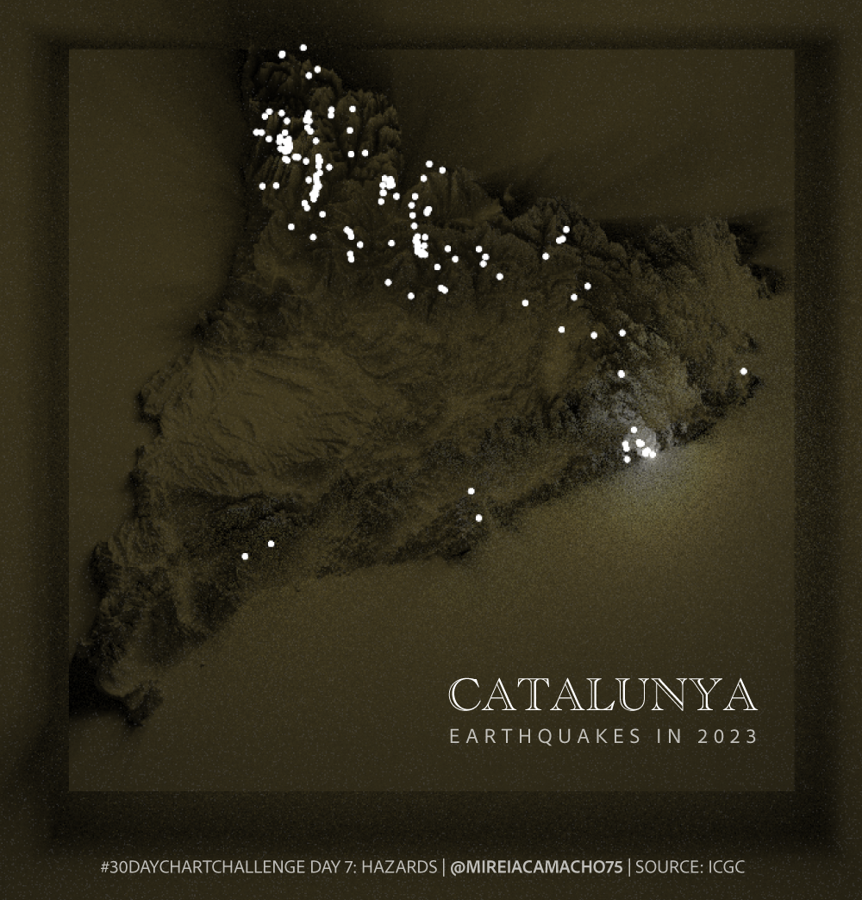

## Day 8: Circular
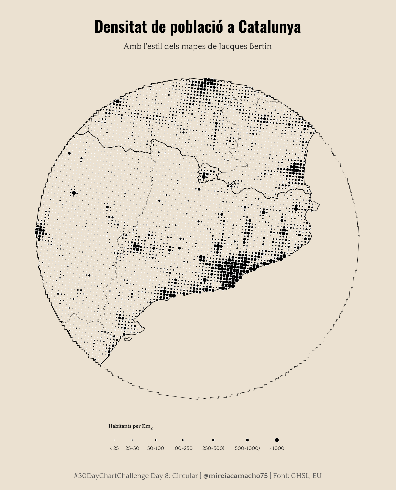

## Day 9: Major/Minor (Data Day)
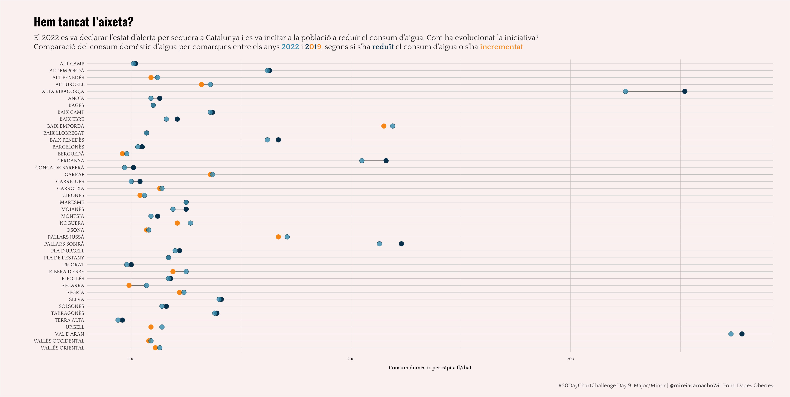

## Day 10: Physical
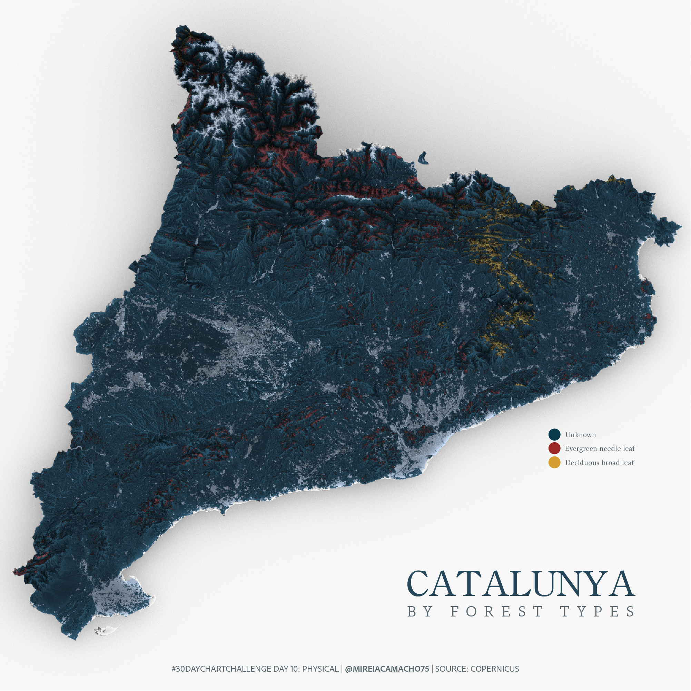

## Day 11: Mobile Friendly
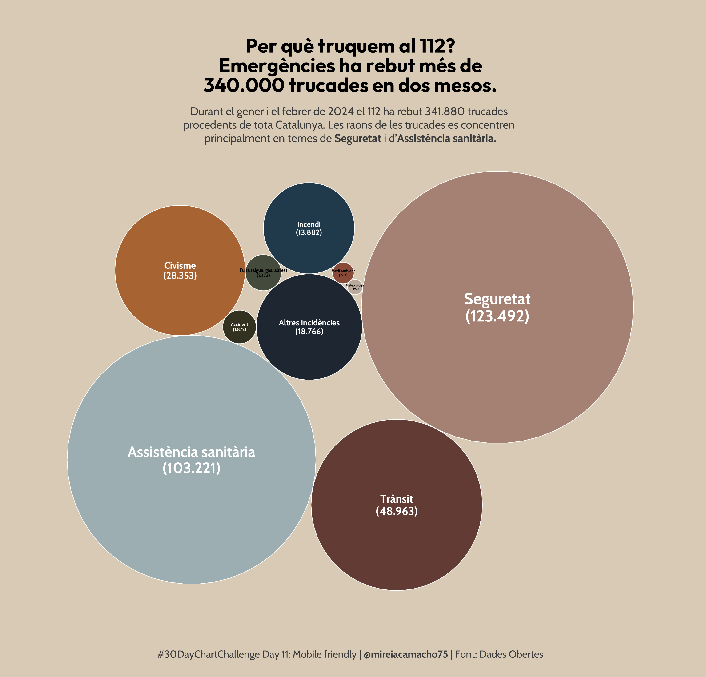

## Day 13: Family
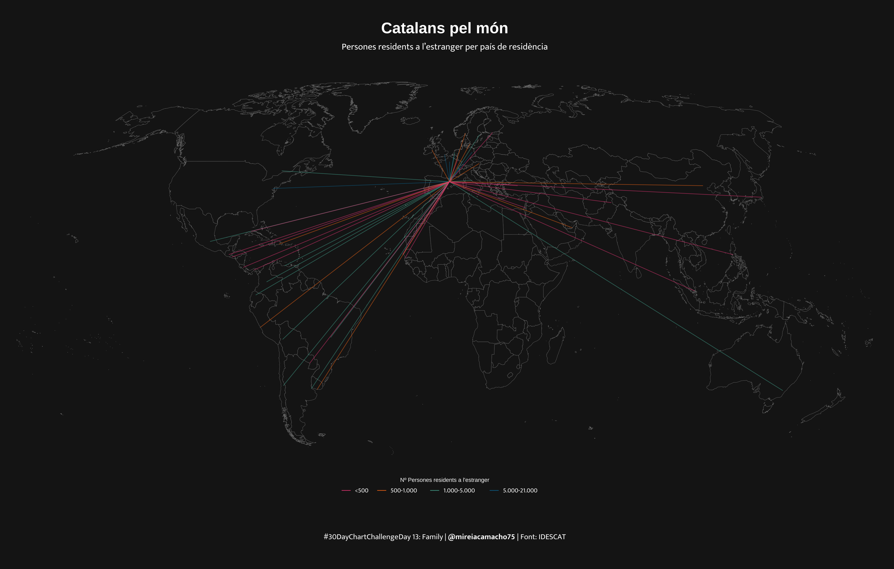

## Day 14: Heatmap
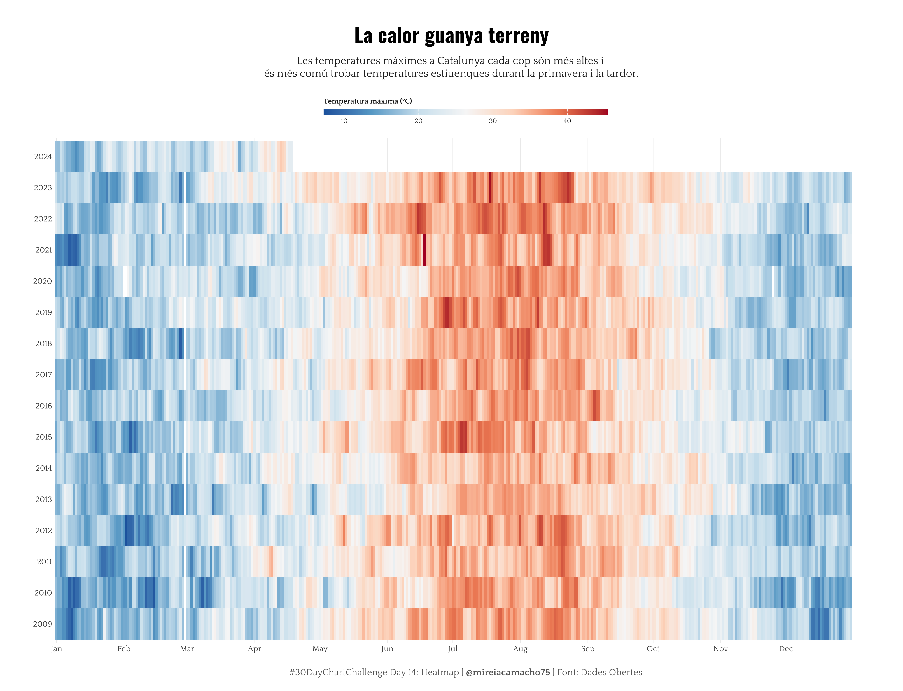

## Day 15: Historic

## Day 16: Weather
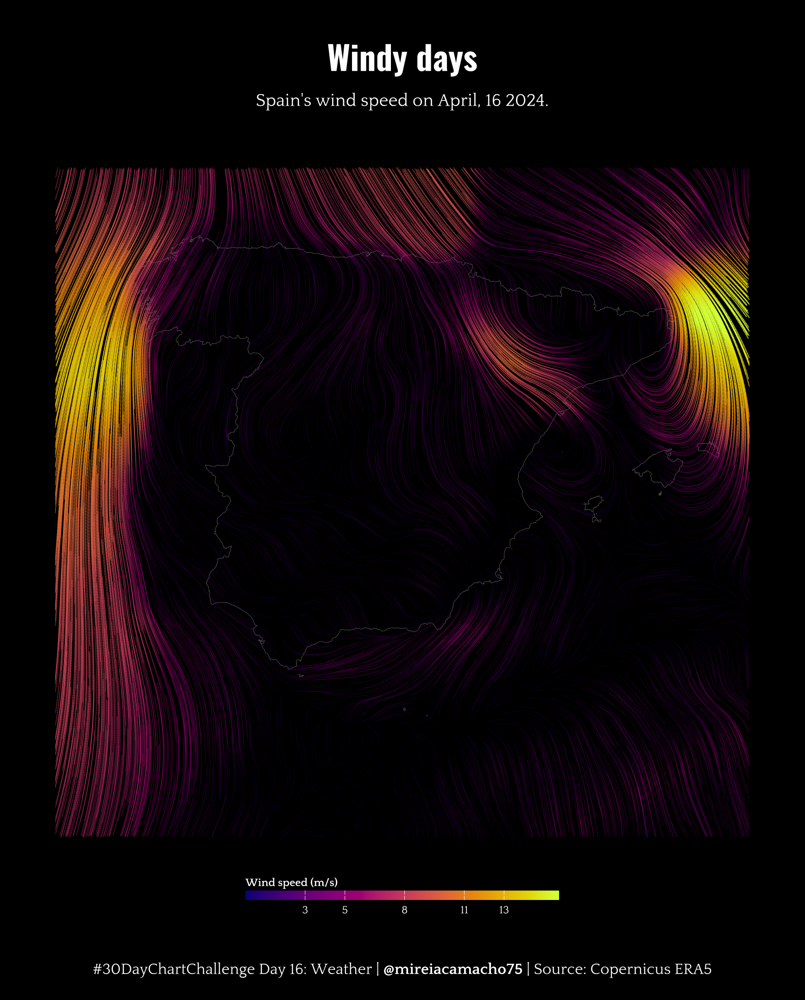

## Day 19: Dinosaurs
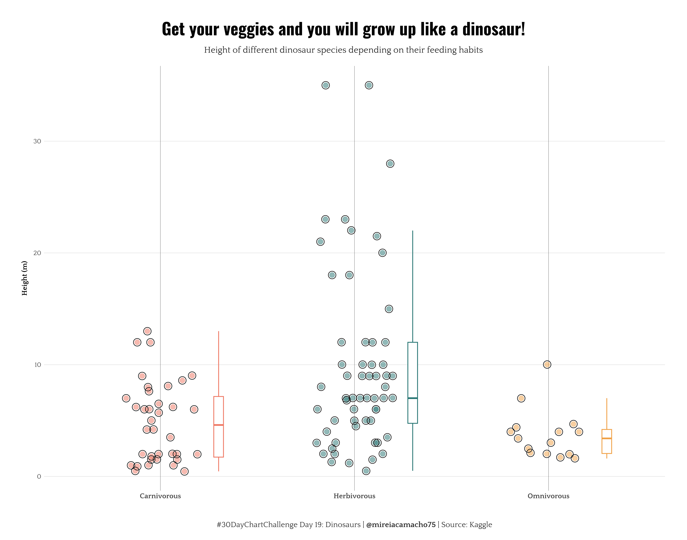

## Day 22: Mobility
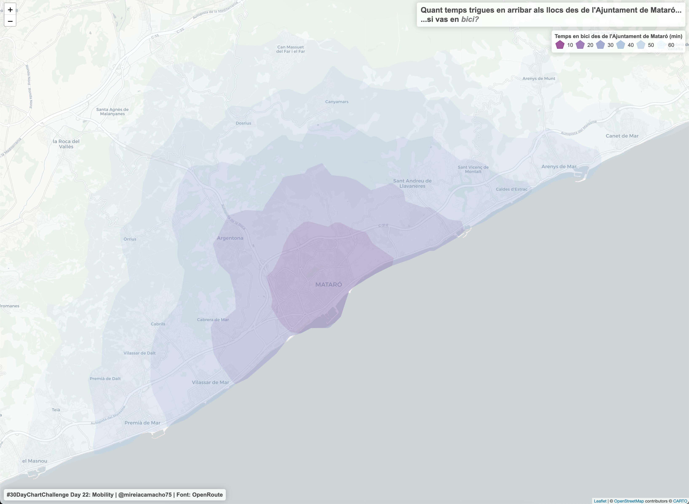

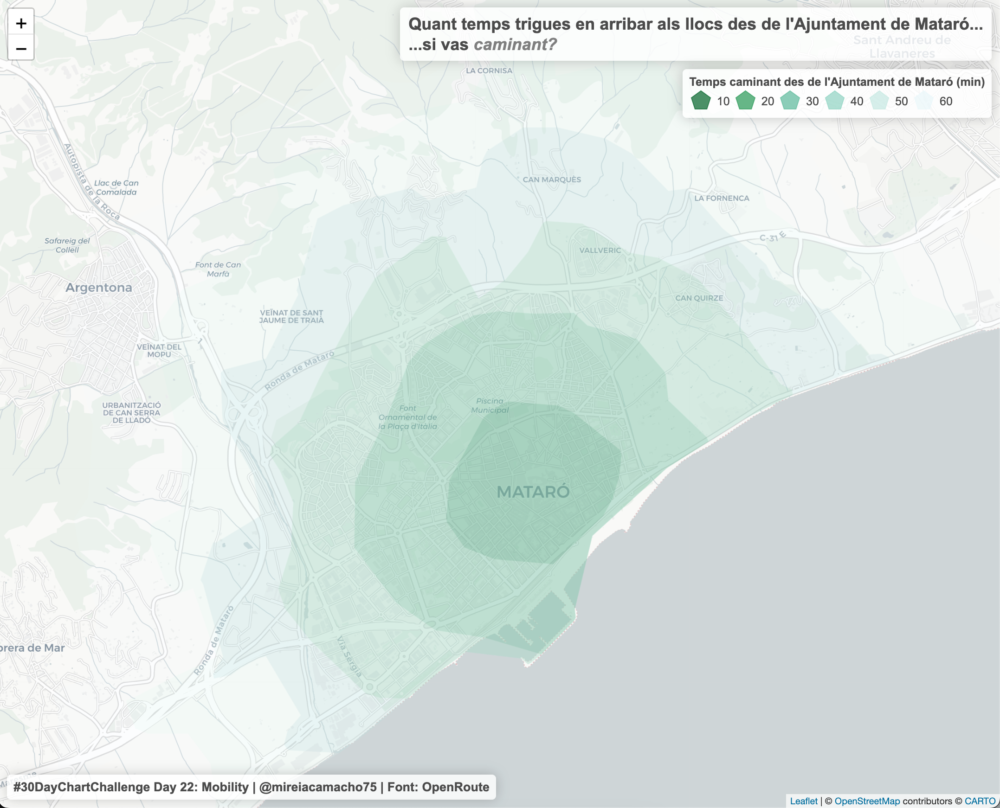

