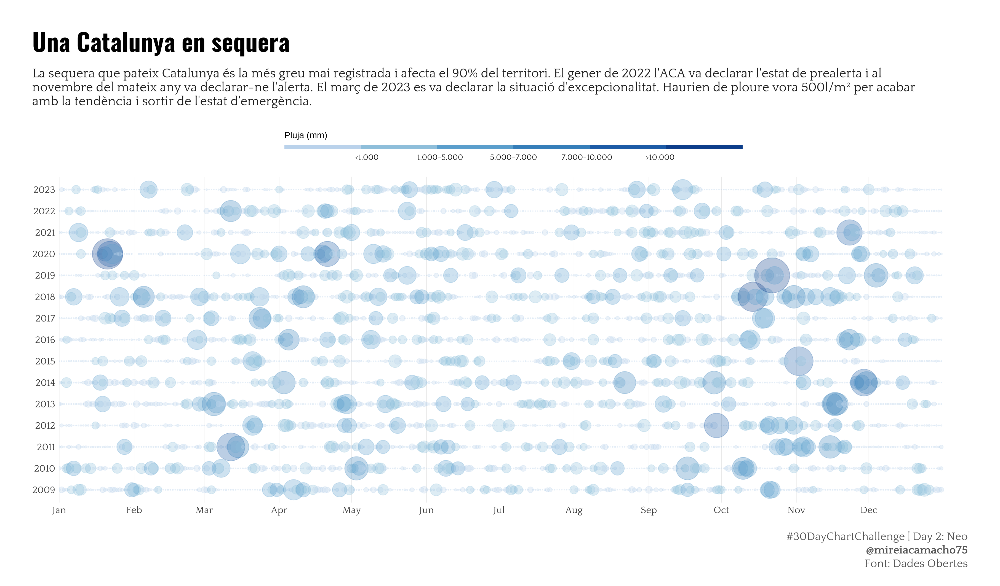
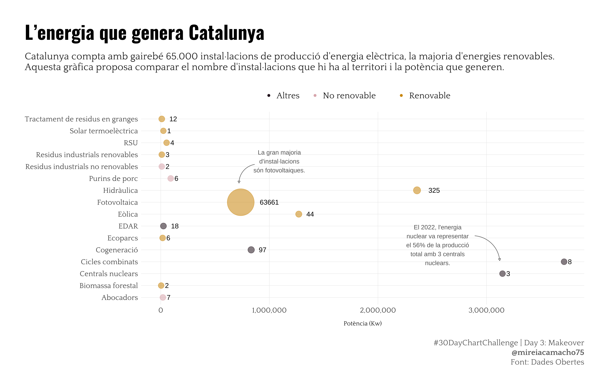
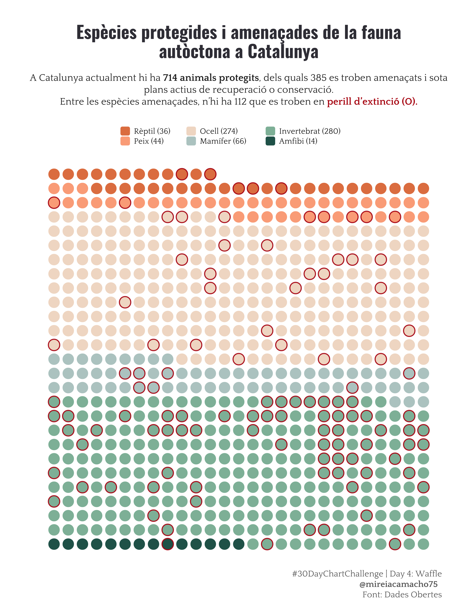
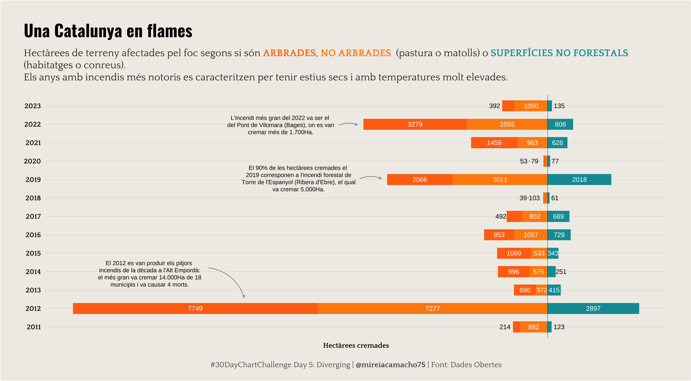

# #30DayChartChallenge 2024

## Day 1: Part-to-whole

## Day 2: Neo

## Day 3: Makeover

## Day 4: Waffle

## Day 5: Diverging

## Day 6: OECD (Data Day)

## Day 7: Hazards

## Day 8: Circular

## Day 9: Major/Minor (Data Day)

